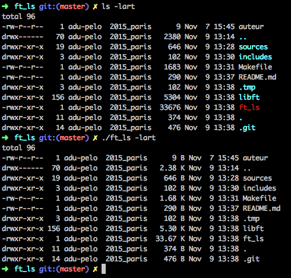

# ft_ls
  
Projet Ecole 42 (Paris)
  
## Synopsis

Le but de ce projet était de recoder la fonction ls du systeme (UNIX, cf. [man ls](http://manpagesfr.free.fr/man/man1/ls.1.html)). Cette commande liste des informations à propos de fichiers.

#### Options disponibles :

* l
* r
* a
* t
* R
  

